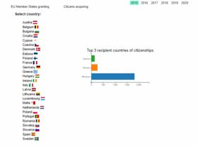
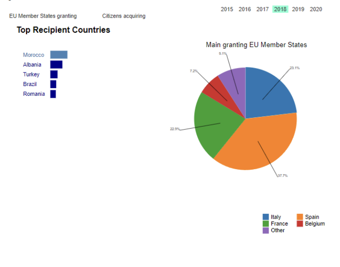

## MIGRATION TO EUROPEAN UNION COUNTRIES (FROM 2015-2020)

The visualizations support general public to understand the scale and patterns of international migration in the EU. They allow
users to explore key indicators such as the number of citizenships granted, the countries of origin and the destination. The visualizations are designed to be
accessible and easy to use, with interactive features that allow users to filter and customize the data to suit their needs. By providing a clear and transparent picture
of migration trends.

# Data: 
* Data source: [Eurostat](https://ec.europa.eu/eurostat/web/main/data)

# Visualization:
* Horizontal bar chart: showing top five countries that obtained EU citizenship
for a specific year on “Citizens Acquiring” tab – The filter and sort options in
the Eurostat dataset were used again to extract the top 5 countries that were
granted EU citizenship for a specific year, and the number of granted
citizenships were also obtained for each of the top five.

* Pie Chart showing breakdown of granted citizenships amongst EU member
countries for a selected top five EU citizenship acquiring expat country, for a
specific year – The filter and sort options from the Eurostat dataset is used
once again to obtain the top countries that granted EU citizenship, to a top five
EU citizenship acquiring expat country that is selected, for a specific year. The
number of granted citizenships for the top four EU countries are taken and
converted to a percentage by calculation, out of the total for the expat country.
The remainder of the total citizenships is calculated as a percentage for
“Other”. The data for percentages of granted citizenships is recorded for
visualisation through a pie chart.

